# Git & GitHub — Notes in Plain English

> Think of **Git** as a time machine for your code. It lets you save snapshots of your work, go back to any snapshot, and share your work with others — without ever losing anything.
> Think of **GitHub** as Google Drive for your code — a website where all those snapshots live online so others can see, download, or collaborate on them.

---

## Table of Contents

1. [What is Git vs GitHub?](#1-what-is-git-vs-github)
2. [Installing Git](#2-installing-git)
3. [Configuring Git (First-Time Setup)](#3-configuring-git-first-time-setup)
4. [Starting a Git Repository](#4-starting-a-git-repository)
5. [The Git File Lifecycle](#5-the-git-file-lifecycle)
6. [Common Git Commands](#6-common-git-commands)
7. [Git Branches](#7-git-branches)
8. [Merge Conflicts & How to Fix Them](#8-merge-conflicts--how-to-fix-them)
9. [Git Stash — Save Work Without Committing](#9-git-stash--save-work-without-committing)
10. [Git Diff — See What Changed](#10-git-diff--see-what-changed)
11. [Git Restore — Undo Changes](#11-git-restore--undo-changes)
12. [Git Revert & Reset — Going Back in Time](#12-git-revert--reset--going-back-in-time)
13. [Git Rebase vs Merge](#13-git-rebase-vs-merge)
14. [Git Squash — Tidy Up Commits](#14-git-squash--tidy-up-commits)
15. [Tags & Releases](#15-tags--releases)
16. [.gitignore — Hiding Files from Git](#16-gitignore--hiding-files-from-git)
17. [README Files](#17-readme-files)
18. [Contributing to Open Source](#18-contributing-to-open-source)
19. [Pull Requests](#19-pull-requests)
20. [Git Workflows (GitFlow & GitHub Flow)](#20-git-workflows-gitflow--github-flow)
21. [Writing Good Commit Messages](#21-writing-good-commit-messages)
22. [Quick Reference Cheatsheet](#22-quick-reference-cheatsheet)

---

## 1. What is Git vs GitHub?

|                              | Git                               | GitHub                         |
| ---------------------------- | --------------------------------- | ------------------------------ |
| **What it is**               | A tool installed on your computer | A website (cloud)              |
| **What it does**             | Tracks changes to your files      | Hosts your Git projects online |
| **Works without the other?** | Yes — Git works offline           | No — GitHub needs Git          |
| **Analogy**                  | Your personal journal             | Publishing that journal online |

---

## 2. Installing Git

### Windows

1. Go to [https://git-scm.com/downloads](https://git-scm.com/downloads)
2. Download and run the installer
3. Open **Git Bash** or **Command Prompt** and verify:

```bash
git --version
# Output: git version 2.39.2
```

### Mac

```bash
xcode-select --install                          # step 1: install Xcode tools
brew install git                                # step 2: install Git via Homebrew
git --version                                   # verify
```

### Linux (Ubuntu / Debian)

```bash
sudo apt-get update
sudo apt-get install git
git --version
```

---

## 3. Configuring Git (First-Time Setup)

Before Git can track _who_ made changes, you need to tell it your name and email.
Think of this like signing your name on every sticky note you ever write.

```bash
git config --global user.name  "Your Name"
git config --global user.email "your-email@example.com"

# Optional: set your preferred text editor
git config --global core.editor nano

# See all your settings
git config --list
```

> **Tip:** `--global` means this applies to every project on your computer.
> If you need different settings per project, run the same commands _without_ `--global` inside that project folder.

---

## 4. Starting a Git Repository

### Brand new project

```bash
mkdir my-project        # create a folder
cd my-project           # go inside it
git init                # turn it into a Git repository
```

This creates a hidden `.git` folder — that's where Git stores everything.

### Existing project on GitHub (download to your machine)

```bash
git clone https://github.com/username/repo-name.git
```

### Full beginner flow — from zero to first commit

```bash
git init
git add index.py                    # stage the file
git commit -m "first file added"    # save a snapshot
git push origin main                # upload to GitHub
```

---

## 5. The Git File Lifecycle

Every file in your project goes through these stages:

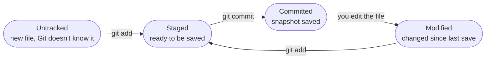

| Stage         | What it means                      | Plain English                             |
| ------------- | ---------------------------------- | ----------------------------------------- |
| **Untracked** | Git sees the file but ignores it   | "I see this file but I'm not watching it" |
| **Staged**    | File is queued for the next commit | "I want to include this in my next save"  |
| **Committed** | File change is saved in history    | "This is now officially saved"            |
| **Modified**  | File changed after last commit     | "Something changed since the last save"   |

---

## 6. Common Git Commands

### The Daily Workflow

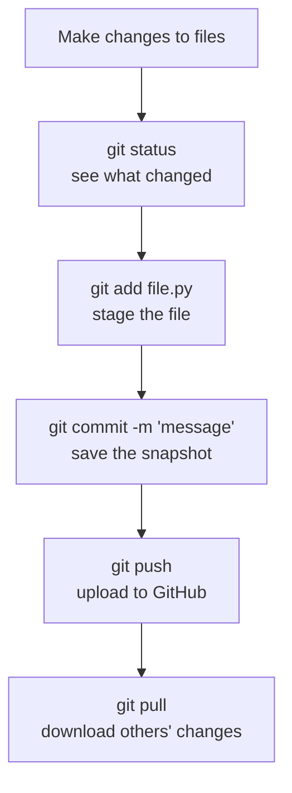

### Commands at a Glance

| Command               | What it does                        | Example                            |
| --------------------- | ----------------------------------- | ---------------------------------- |
| `git init`            | Start a new repo in current folder  | `git init`                         |
| `git clone <url>`     | Download a repo from GitHub         | `git clone https://github.com/...` |
| `git status`          | See which files changed             | `git status`                       |
| `git add <file>`      | Stage a file for commit             | `git add main.py`                  |
| `git add .`           | Stage ALL changed files             | `git add .`                        |
| `git commit -m "msg"` | Save a snapshot with a message      | `git commit -m "fix login bug"`    |
| `git log`             | See the full commit history         | `git log`                          |
| `git diff`            | See what exactly changed            | `git diff`                         |
| `git pull`            | Download + merge latest from GitHub | `git pull`                         |
| `git push`            | Upload your commits to GitHub       | `git push origin main`             |
| `git branch`          | List all branches                   | `git branch`                       |
| `git merge`           | Merge one branch into another       | `git merge feature-x`              |

---

## 7. Git Branches

### What is a branch?

Imagine you're writing a book. The **main** branch is the published version.
You want to try a new chapter but aren't sure if it'll be good — so you make a **copy** (branch), write there, and only paste it into the book when you're happy.

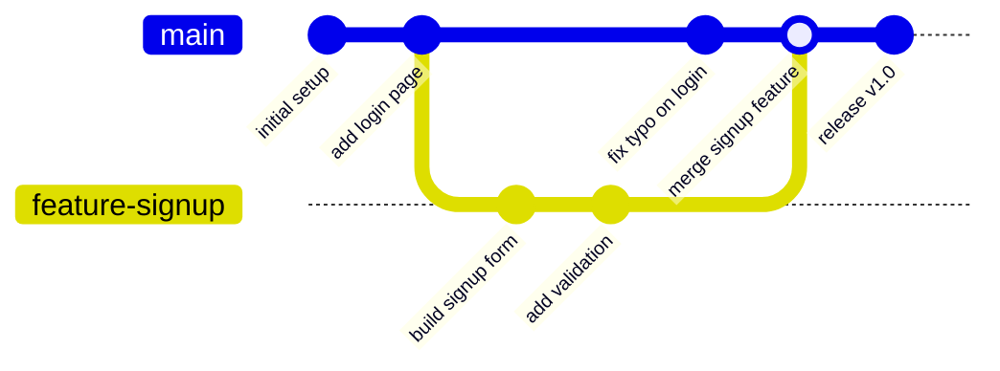

### Branch Commands

```bash
# create a new branch
git branch feature-login

# switch to it
git checkout feature-login
# OR (modern way, same result)
git switch feature-login

# create AND switch in one command
git checkout -b feature-login

# see all branches (* marks the current one)
git branch

# merge your feature back into main
git checkout main
git merge feature-login

# delete the branch once merged (cleanup)
git branch -d feature-login
```

### Branch Naming Tips

| Type            | Prefix     | Example                     |
| --------------- | ---------- | --------------------------- |
| New feature     | `feature-` | `feature-user-profile`      |
| Bug fix         | `fix-`     | `fix-image-upload-crash`    |
| Hotfix (urgent) | `hotfix-`  | `hotfix-payment-null-error` |
| Release         | `release-` | `release-v2.1`              |

> Keep names short, lowercase, and use hyphens — no spaces or special characters.

---

## 8. Merge Conflicts & How to Fix Them

### When does a conflict happen?

You and a teammate both edited the **same line** in the same file, and Git doesn't know which version to keep.

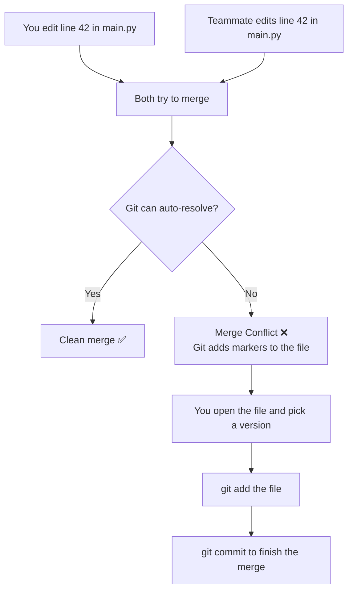

### What the conflict looks like in your file

```
<<<<<<< HEAD
# your version of the line
result = a + b
=======
# your teammate's version
result = a + b + c
>>>>>>> feature-branch
```

### How to fix it

1. Open the file in your editor
2. Delete the `<<<<`, `====`, `>>>>` markers
3. Keep whichever version (or combine them) makes sense
4. Save the file
5. Run:

```bash
git add main.py
git commit -m "resolved merge conflict in main.py"
```

> **Pro tip:** Always run `git pull` before you start working. This keeps you up to date and reduces conflicts.

---

## 9. Git Stash — Save Work Without Committing

### What is it?

Imagine you're mid-way through writing code and your manager says "Drop everything, fix this urgent bug now!"
You don't want to commit half-done code. **Stash it** — like putting your half-finished work in a drawer temporarily.

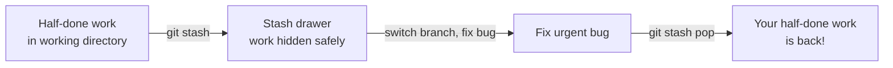

### Stash Commands

```bash
git stash                       # save current work to the stash drawer
git stash list                  # see everything in the drawer
git stash apply                 # bring back the latest stash (keeps stash)
git stash pop                   # bring back latest stash AND remove it
git stash apply stash@{2}       # apply a specific stash by number
git stash drop stash@{0}        # delete a specific stash
git stash clear                 # empty the entire drawer
git stash show                  # see what's inside the latest stash
```

---

## 10. Git Diff — See What Changed

Think of `git diff` as a highlighter — it shows you exactly which lines were added (green +) or removed (red -).

```bash
git diff                            # changes in working dir vs last commit
git diff main feature-x             # difference between two branches
git diff HEAD~2 HEAD~1              # difference between two commits
git diff index.html                 # diff for one specific file
git diff --color-words              # show word-level changes (cleaner view)
```

---

## 11. Git Restore — Undo Changes

Made a mess of a file? Restore it to how it was.

```bash
# Throw away all unsaved changes in a file (back to last commit)
git restore file.txt

# Unstage a file (remove from "staged" without losing changes)
git restore --staged file.txt

# Restore a file to how it looked in a specific older commit
git restore --source=abc1234 file.txt
```

---

## 12. Git Revert & Reset — Going Back in Time

### Git Revert — Safe undo (adds a new commit)

```bash
git revert HEAD~1           # undo the last commit (safely)
git revert abc1234          # undo a specific commit by its hash
```

> Revert is **safe** — it doesn't erase history, it just adds a new commit that cancels the old one.
> Use this on shared/public branches.

### Git Reset — Powerful undo (rewrites history)

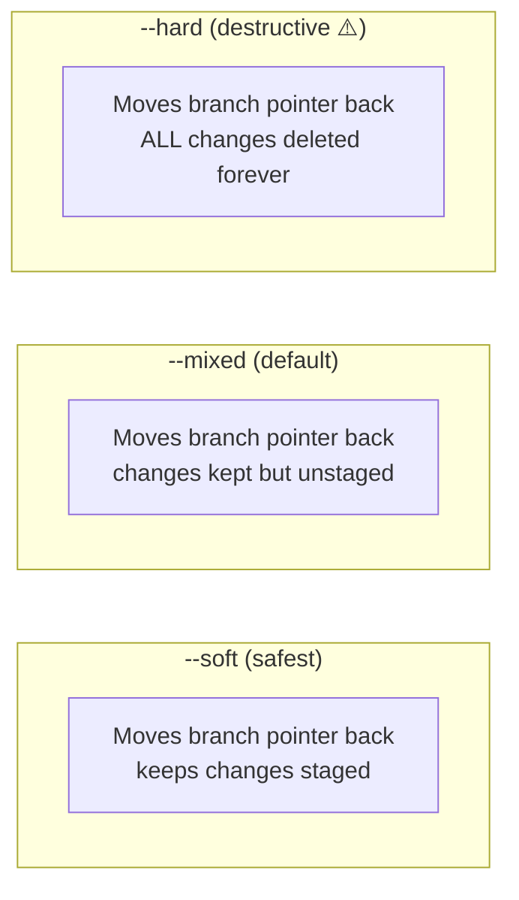

```bash
git reset --soft HEAD~1     # undo last commit, keep changes staged
git reset HEAD~1            # undo last commit, keep changes unstaged
git reset --hard HEAD~1     # undo last commit, DELETE all changes ⚠️
git reset --hard HEAD       # throw away ALL uncommitted changes ⚠️
```

> **Rule of thumb:** Use `revert` on shared branches. Use `reset` only on your own private branch.

---

## 13. Git Rebase vs Merge

Both combine branches — but in different ways.

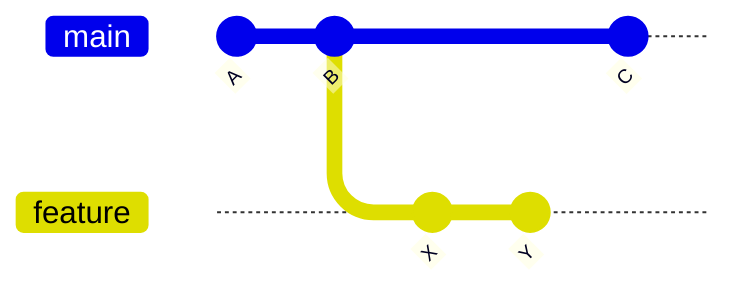

### Merge — keeps the full history (non-linear)

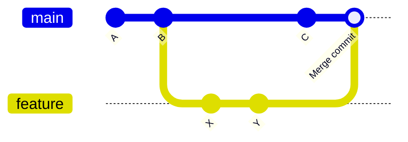

```bash
git checkout main
git merge feature
```

### Rebase — replays your commits on top (linear, clean history)

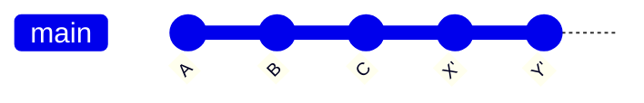

```bash
git checkout feature
git rebase main         # replay feature commits on top of main
```

|                           | Merge                            | Rebase                               |
| ------------------------- | -------------------------------- | ------------------------------------ |
| History                   | Non-linear, shows the full story | Linear, looks like one straight line |
| Safety on shared branches | ✅ Safe                          | ⚠️ Avoid — rewrites history          |
| Best for                  | Team shared branches             | Your own local cleanup               |

---

## 14. Git Squash — Tidy Up Commits

You made 10 small messy commits. Squash them into 1 clean commit before merging.

```bash
git rebase -i HEAD~5        # interactively edit the last 5 commits
```

In the editor that opens, change `pick` → `squash` (or `s`) on the commits you want to combine:

```
pick   abc123  first attempt
squash def456  fixed typo
squash ghi789  another fix
squash jkl012  finally working
```

Save and exit. Git will ask you to write one final commit message for all of them.

---

## 15. Tags & Releases

Tags are bookmarks on specific commits — usually used to mark version releases like `v1.0`.

```bash
git tag v1.0                            # create a lightweight tag
git tag -a v1.0 -m "First release"      # create an annotated tag with message
git tag                                 # list all tags
git show v1.0                           # see details of a tag
git push origin v1.0                    # push the tag to GitHub
git checkout v1.0                       # go back to this version
git tag -d v1.0                         # delete a local tag
```

> On GitHub, tags automatically appear in the **Releases** section — users can download your code at that exact version.

---

## 16. .gitignore — Hiding Files from Git

Some files should never be committed — passwords, large files, OS junk.
The `.gitignore` file tells Git to pretend these files don't exist.

### Create the file

```bash
touch .gitignore
```

### Common entries

```gitignore
# Python stuff
__pycache__/
*.pyc
.venv/

# Secrets
.env
secrets.json

# OS junk
.DS_Store         # Mac
Thumbs.db         # Windows

# Logs
*.log

# IDE files
.vscode/
.idea/
```

> If you already committed a file and now want to ignore it:
>
> ```bash
> git rm --cached file.txt    # stop tracking it (doesn't delete the file)
> # then add file.txt to .gitignore
> git commit -m "stop tracking file.txt"
> ```

---

## 17. README Files

A README is the front page of your GitHub project — the first thing anyone sees.

### What to include

```markdown
# Project Name

One sentence about what this project does.

## How to Install

pip install -r requirements.txt

## How to Use

python main.py

## Examples

show a quick example here

## Contributing

explain how others can help

## License

MIT
```

> Keep it short, clear, and beginner-friendly. Update it when things change.

---

## 18. Contributing to Open Source

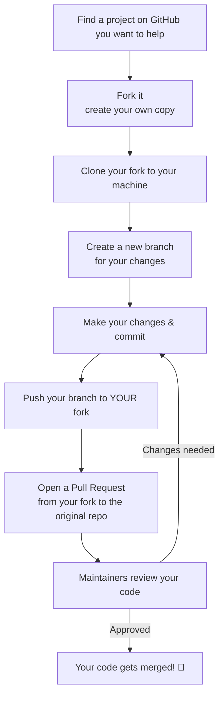

### Step-by-step commands

```bash
# 1. Fork on GitHub (click Fork button)

# 2. Clone your fork
git clone https://github.com/YOUR_USERNAME/repo-name.git

# 3. Create a new branch
cd repo-name
git checkout -b fix-broken-link

# 4. Make your changes, then commit
git add README.md
git commit -m "fix broken link in README"

# 5. Push to your fork
git push origin fix-broken-link

# 6. Go to GitHub and click "Compare & pull request"
```

---

## 19. Pull Requests

A pull request (PR) is a formal way of saying:

> "Hey team, I made some changes on my branch. Can you review them and merge them into main?"

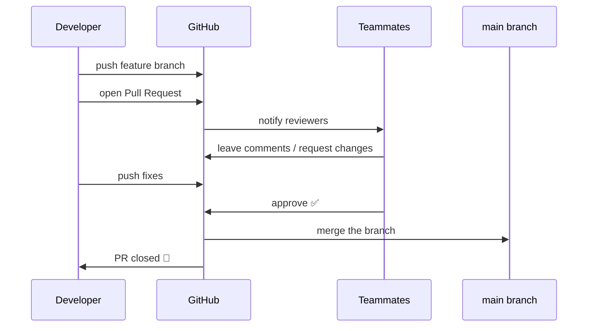

---

## 20. Git Workflows (GitFlow & GitHub Flow)

### GitHub Flow — simple, great for small teams

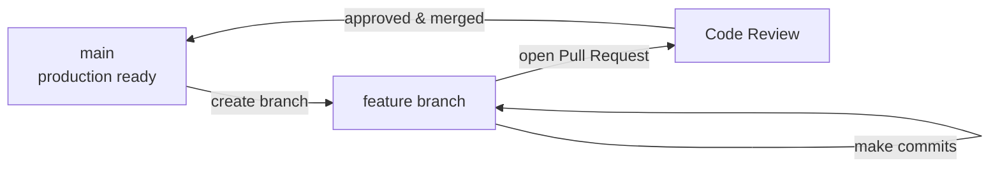

```bash
git checkout -b feature-dark-mode   # branch off main
# ... make changes ...
git push origin feature-dark-mode   # push it
# open PR on GitHub → review → merge → done
```

---

### GitFlow — structured, great for larger teams with releases

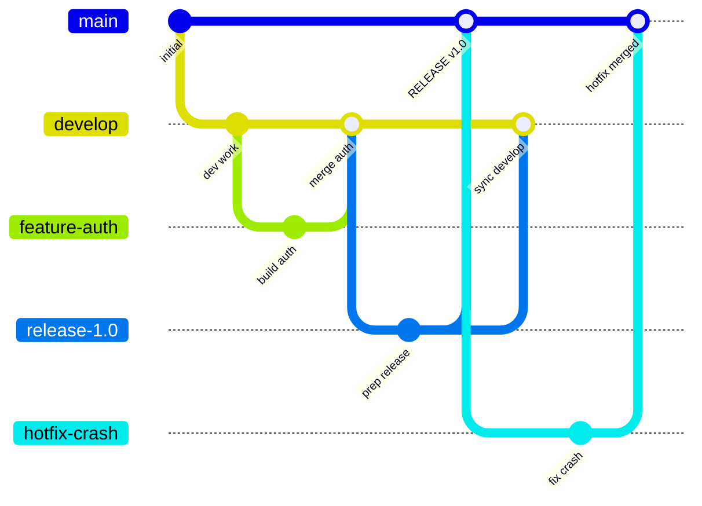

| Branch      | Purpose                             |
| ----------- | ----------------------------------- |
| `main`      | Always production-ready code        |
| `develop`   | Integration branch for ongoing work |
| `feature-*` | One branch per new feature          |
| `release-*` | Prep for a new version              |
| `hotfix-*`  | Urgent fixes directly off main      |

---

## 21. Writing Good Commit Messages

A commit message is a note to your future self (and teammates) explaining _what changed and why_.

### Bad vs Good examples

| Bad ❌           | Good ✅                                       |
| ---------------- | --------------------------------------------- |
| `fix`            | `fix login page not redirecting after submit` |
| `update`         | `update README with installation steps`       |
| `asdfgh`         | `add email validation to signup form`         |
| `final final v2` | `remove debug print statements from payments` |

### Tips

- Keep the first line under **50 characters**
- Use plain English — write like you're texting a teammate
- Say **what** changed, not just **how**
- If needed, add a longer description after a blank line

```bash
# Short, clear commit
git commit -m "add dark mode toggle to navbar"

# Commit with more detail
git commit -m "fix null error in user profile

When a user has no profile picture, the page was
crashing. Added a fallback to a default avatar image."
```

---

## 22. Quick Reference Cheatsheet

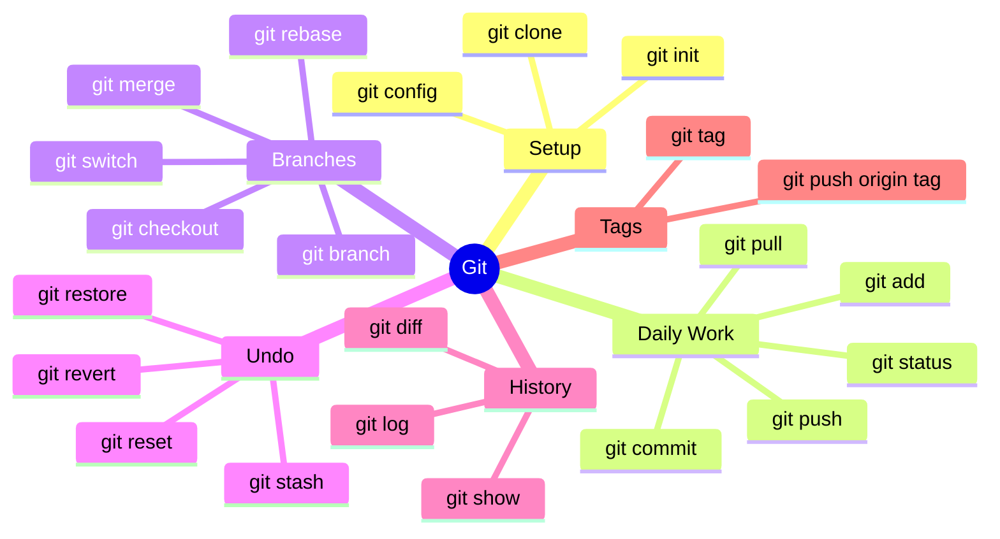

### One-liner combos

```bash
git commit -a -m "message"          # stage all tracked files + commit in one step
git checkout -b new-branch          # create + switch to branch in one step
git push -u origin main             # push + set upstream tracking in one step
git pull --rebase                   # pull and rebase instead of merge
```

### Helpful aliases you can set

```bash
git config --global alias.st status
git config --global alias.co checkout
git config --global alias.br branch
git config --global alias.lg "log --oneline --graph --all"
```

Now instead of `git status` you can type `git st`. Easy!

---

> **Remember:** Git is just saving snapshots of your work. You can always go back. Don't be afraid to experiment — that's what branches are for.
